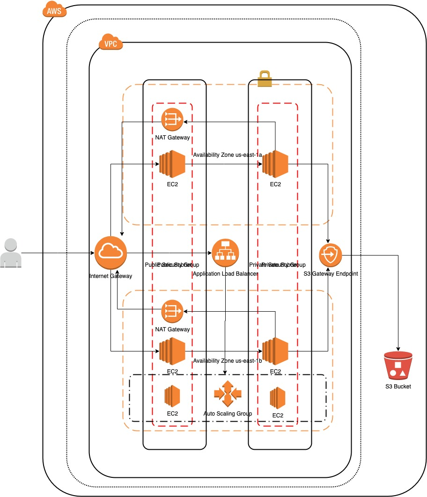

# TERRAFORM

# Prerequisites
- Terraform CLI
- AWS CLI

# How to
Terraform lifecycle 


```sh
Make sure you update provider.tf profile to valid AWS CLI configured profile
```

Make sure following varialbes are set correctly
```sh
install-in-number-of-availability-zone
    set this varialbe to number of AZs you wuold like to have your public and private subnet.

install-s3
    set this to true to setup s3, else false

install-asg-alb
    set this to true to setup Launch Template, Auto Scalling Group, Target Group, Application Load Balancer, and Listner.
```

```sh
terraform init
terraform fmt
terraform validate
terraform plan
terraform apply --auto-apply
terraform destroy --auto-apply
```

Validate access using ssh
```sh
ssh-add -K main-key.pem
ssh-add -l # to verify
ssh -A <public ip address (or dns) of public ec2 instance>
once logged in to public ec2 instance, login to private ec2
ssh <private ec2 instance private ip>
aws s3 ls
aws s3 ls s3://<s3 bucket name> # to list the content of the bucket
```

# install-in-number-of-availability-zone > 0 and install-s3 = true

